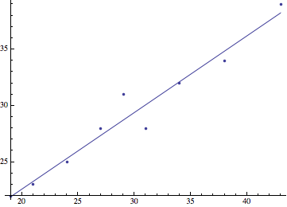
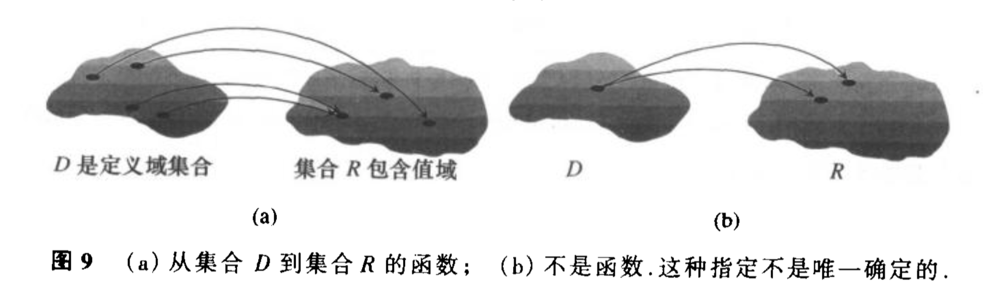

# Perliminaries 预备
	三角函数描述循环、重复的活动；指数、对数和逻辑斯蒂函数描述增长和衰减；多项式函数可用来近似表示这些函数或者其它函数。
	
* 直线
* 函数和图形
* 指数函数
* 反函数和对数函数
* 三角函数及其反函数
* 参数方程
* 对变化进行建模

## 1 直线
	点，增量(两点)，直线斜率，平行直线和垂直线，直线的方程，直线回归(应用)
	
### 增量
定义：如果一个质点从点($$$x_1$$$,$$$y_1$$$)移到点($$$x_2$$$,$$$y_2$$$)，其坐标点增量为
$$$\Delta x	= x_2 - x_1$$$ 和 $$$\Delta y = y_2 - y_1$$$ .

### 直线的斜率
定义：设点$$$P_1(x_1,y_1)$$$和$$$P_2(x_2,y_2)$$$是非垂直线L上的两点，L的斜率为
$$$ m = {rise \over run} = { \Delta y \over \Delta x} = { y_2-y_1 \over x_2-x_1}$$$
	
	注意:非垂直平行线没有斜率。


### 平行直线和垂直线
平行线与$$$x$$$轴的夹角相等，因此非垂直的平行线具有相同的斜率;反之具有相同斜率的直线与$$$x$$$轴的夹角相等，所以是平行线。

如果两条非垂直直线$$$L_1$$$与$$$L_2$$$是相互垂直的，其斜率$$$m_1$$$与$$$m_2$$$满足$$$m_1m_2=-1$$$,所以每个斜率是另一个斜率的负倒数。

### 直线的方程
#### 点斜式
定义：方程 $$$ y = m(x-x_1)+y_1 $$$ 是过点$$$(x_1,y_1)$$$且斜率为$$$m$$$的直线的点－斜式方程。
#### 截距式
定义：方程 $$$ y = mx + b $$$ 是斜率为 $$$ m $$$ 而 $$$$ y $$$-截距为$$$ b $$$ 的直线的斜率－截距方程。
#### 一般线性方程
定义：方程 $$$ Ax +  By = C $$$ ($$$  A $$$ 和 $$$ B $$$ 不全为零) 是 $$$ x,y $$$ 的一般线性方程。

### 直线回归(应用)
把一组成对的数据通过散点图表示，寻找是否存在某种模式或者趋势。若存在某种模式，我们能找到一条近似表达这种模式的方程，那么可以通过这条方程近似预测数据的趋势。我们把寻找这条能拟合数据的曲线方程的过程称之为回归分析，该曲线就是回归曲线。
也就是说，回归分析就是寻找能拟合数据的曲线方程。

#### 回归分析四步骤
1. 图示数据;
2. 求回归方程，对直线而言方程的形式为 $$$ y = mx + b $$$ ;
3. 把回归方程的图重叠在散点图赏看拟合情况;
4. 如果拟合满意，用回归方程来预测不在表中的 $$$ x $$$ 值的 $$$ y $$$值。


### 习题
* 备注：习题中使用到的绘图工具是mathmatica

* 参考：[How to|进行线性回归]<http://reference.wolfram.com/language/howto/PerformALinearRegression.html.zh>

					
T 37

对列表中女孩的体重绘制散点图，求回归方程
 
1. 生成数据集：
```
	data = {{19, 22}, {21, 23}, {24, 25}, {27, 28}, {29, 31}, {31, 28}, {34, 32}, {38, 34}, {43, 39}};
```
2. 用 LinearModelFit 创建数据的线性模型：
```
	model = LinearModelFit[data, x, x]
```	
3. 提取线性模型：
```
model[“BestFit”]
```
4. 绘制模型的函数形式：
```
Plot[model["BestFit"], {x, 0, 43}]
```
5. 显示数据和最佳拟合直线：
```
Show[ListPlot[data], Plot[model["BestFit"], {x, 0, 43}]]
```

```
data = {{19, 22}, {21, 23}, {24, 25}, {27, 28}, {29, 31}, {31,28}, {34, 32}, {38, 34}, {43, 39}};
f1 = ListPlot[data, PlotStyle -> PointSize[0.01]];
f2 = Plot[0.680*x + 9.013, {x, 19, 43}, AspectRatio -> Automatic];
Show[f1, f2, AspectRatio -> Automatic]；
```

 

(a) 求得线性回归方程为：$$$ y = 9.01254 + 0.680027 x $$$ <br/>
(b) 斜率为: 0.680027,表示女孩的体重每月增加0.680027磅。<br/>
(c) 见上图；<br/>
(d) 预测30个月大的女孩体重约为 29.41335 磅。<br/>


T 39

对房价求散点图和线性回归方程。

1. 数据集: <br/>
东北部
```
dataNortheast = {{0,25.2},{5,39.3},{10,60.8},{15,88.9},{20,141.2}} 
```
<br/>中西部：
```
dataMinwest = {{0,20.1},{5,30.1},{10,51.9},{15,58.9},{20,74.0}}
```
2. 用 LinearModelFit 创建数据的线性模型:
```
model = LinearModelFit[dataNortheast, x, x]
```
3. 提取线性模型：
```
model[“BestFit”]
```

(a) 东北地区房价的线性方程为: $$$ y = 14.76 + 5.632x $$$ <br/>
(b) 斜率表示每年房价的增长为5632美元 <br/>
(c) 中西部地区的房价的线性回归方程为: $$$ y = 19.68 + 2.732x$$$ <br/>
(d) 东北部的房价增长比较快。<br/>

<br/>
<br/>
<br/>
<br/>
<br/>


## 2 函数和图形
	函数的组成：定义域、值域；对应法则；图形。
	函数的特性：增函数、减函数；偶函数、奇函数(对称性)。
	特例：分段定义的函数，绝对值函数。
	移位图形。
	符合函数。
	 
### 函数
* 一个变量(因变量)的值取决于另一个变量(自变量)的值。
* 定义: 从集合$$$ D $$$到集合$$$R$$$的一个函数是对$$$D$$$中每个元素指定$$$R$$$中惟一确定的元素的一种规则。$$$D$$$是函数的定义域，$$$R$$$是函数的值域。
* 符号表示: $$$ y = f(x) $$$ (念 'y' 等于 ‘f’ ‘x’)




### 定义域和值域
* 区间:开区间，闭区间，半开半闭区间；
* 边界点:区间的端点；
* 内点:边界点外的点； 
* 闭区间：包括所有边界点在内的区间；
* 开区间：不包括边界点在内的区间；

#### 审阅和解释图形
1. 识别图形是合理的,需要经验指导(指导基本图函数的图形特性)
2. 看出图形的重要特征(增减性，奇偶性、周期性等)
3. 解析这些特征
4. 识别绘图器的失效

### 增函数与减函数
	偶函数和奇函数的图形具有对称性的表征。
	偶函数：关于y轴对称；
	奇函数：关于原点对称；
	
定义: 如果$$$ f(-x)=f(x)$$$,函数$$$ y =  f(x)$$$ 是 $$$x$$$ 的偶函数;如果$$$ f(-x) = -f(x)$$$,函数$$$ y =  f(x)$$$ 是 $$$x$$$ 的奇函数。

### 分段定义的函数

### 绝对值函数
绝对值函数$$$ y=|x|$$$是由公 
$$
f(n) =  
\begin{cases}  
n/2, &\\text{if $n$ is even} \\[2ex]
3n+1, &\text{if $n$ is odd}  
\end{cases}
$$


	


 


	
