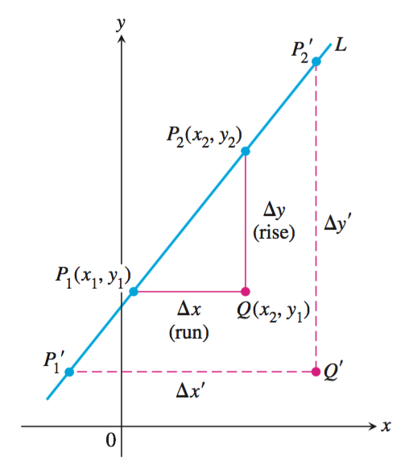

# Perliminaries 预备
	三角函数描述循环、重复的活动；指数、对数和逻辑斯蒂函数描述增长和衰减；多项式函数可用来近似表示这些函数或者其它函数。
	
* 直线
* 函数和图形
* 指数函数
* 反函数和对数函数
* 三角函数及其反函数
* 参数方程
* 对变化进行建模

## 直线
	点，增量(两点)，直线斜率，平行直线和垂直线，直线的方程，直线回归(应用)
	
### 增量
定义：如果一个质点从点($$$x_1$$$,$$$y_1$$$)移到点($$$x_2$$$,$$$y_2$$$)，其坐标点增量为
$$$\Delta x	= x_2 - x_1$$$ 和 $$$\Delta y = y_2 - y_1$$$ .

### 直线的斜率
定义：设点$$$P_1(x_1,y_1)$$$和$$$P_2(x_2,y_2)$$$是非垂直线L上的两点，L的斜率为
$$$ m = {rise \over run} = { \Delta y \over \Delta x} = { y_2-y_1 \over x_2-x_1}$$$
	
	注意:非垂直平行线没有斜率。

### 平行直线和垂直线
平行线与$$$x$$$轴的夹角相等，因此非垂直的平行线具有相同的斜率;反之具有相同斜率的直线与$$$x$$$轴的夹角相等，所以是平行线。

如果两条非垂直直线$$$L_1$$$与$$$L_2$$$是相互垂直的，其斜率$$$m_1$$$与$$$m_2$$$满足$$$m_1m_2=-1$$$,所以每个斜率是另一个斜率的负倒数。
### 直线的方程
#### 点斜式
定义：方程 $$$ y = m(x-x_1)+y_1 $$$ 是过点$$$(x_1,y_1)$$$且斜率为$$$m$$$的直线的点－斜式方程。
#### 截距式
定义：方程 $$$ y = mx + b $$$ 是斜率为 $$$ m $$$ 而 $$$$ y $$$-截距为$$$ b $$$ 的直线的斜率－截距方程。
#### 一般线性方程
定义：方程 $$$ Ax +  By = C $$$ ($$$  A $$$ 和 $$$ B $$$ 不全为零) 是 $$$ x,y $$$ 的一般线性方程。
### 直线回归(应用)

	
